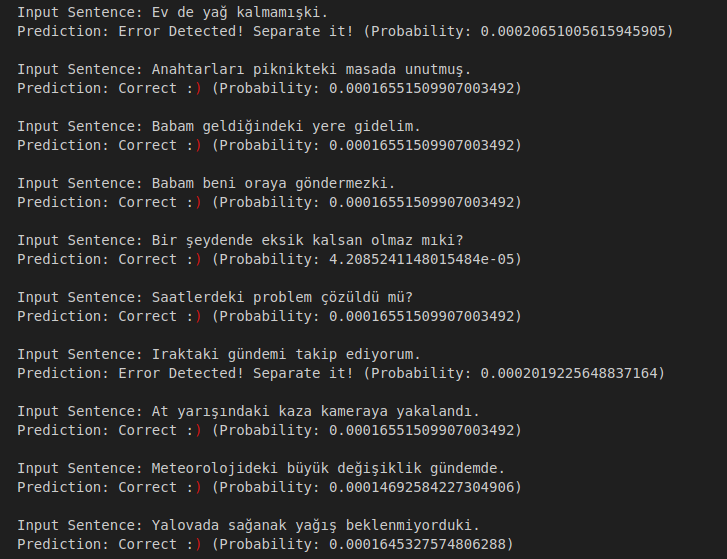

<div align="center">
<h2>
    Estimating Correct Writing of "de/da" and "ki" Clitics' for Turkish: Conjunction or Locative Suffixes 
</h2>
<div>
    
</div>
<div>
  <a target="_blank" href="https://colab.research.google.com/github/asumansaree/TurkishSpellChecker"></a>
</div>
</div>


## 🌟 Project Description

The “de/da” clitic in Turkish is a conjunction when it is written separately and has the same meaning as "as well", "too", and "also" in English. In addition to being a conjunction, the “de” and “da” homonyms may be used as locative suffixes meaning “at” or “in”. For example, the word “araba” (car) with the suffix “-da” (“arabada”) means “in the car”. Although the “de/da” clitic in the meaning of conjunction must always be written separately, it is commonly confused with the locative suffix "de/da" and incorrectly written concatenated to the previous word. This project focuses on a common spelling error in Turkish, namely the spelling of the “de/da” and "ki" clitics.


Detailed explanation about the project is in this document:
[Document](https://docs.google.com/document/d/1QWuNjbqzHDiUPuNGvgu71QiEEnNdLOsGPSEPKYMwR0k/edit?usp=sharing)


## 📜 Installation

```bash
git clone https://github.com/asumansaree/TurkishSpellChecker
cd TurkishSpellChecker
```

## 🤗 Usage
For "de/da" separation testing
```bash
cd Data/
```
Edit the test_sentences_de.txt (or other text_sentences for other models) and save
```bash
cd ../Test
python3 test_for_de_separation.py
```

## 🚀 Sample Output
Output will be printed to the terminal (or if you're using Colab, you'll see it directly)

<br clear="left"/>

## 💬 Contact
Contact me for any problem and question
asumansaree@gmail.com

## 🙏 References

* "Detecting Clitics Related Orthographic Errors in Turkish", Proceedings of Recent Advances in Natural Language Processing, pages 71–76, Varna, Bulgaria, Sep 2–4, 2019.

